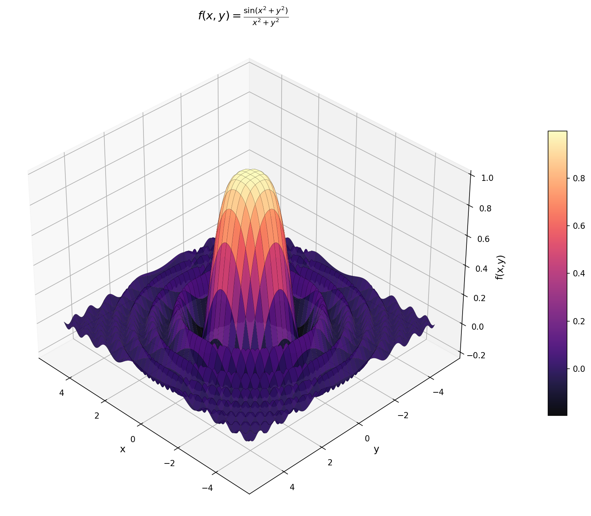

# Optimization Algorithms Repository

  

Welcome to the **Optimization Algorithms Repository**.
This repository provides a collection of Python implementations for a variety of optimization algorithms. These range from one-dimensional optimization methods to multidimensional techniques, constrained optimization, and dynamic programming solutions.

## Table of Contents

* [1D Optimization Algorithms](#1d-optimization-algorithms)
* [Multidimensional Optimization Algorithms](#multidimensional-optimization-algorithms)
* [Constrained Optimization](#constrained-optimization)
* [Dynamic Programming](#dynamic-programming)

---

## [1D Optimization Algorithms](https://github.com/lucasmr19/Optimization/tree/main/1D%20Optimization%20Algorithms)

### Bisection Method

* **Description:** Implements the bisection method for finding roots of a one-dimensional function.
* **File:** `bisection.py`

### Golden Section Search

* **Description:** Implements the golden section search algorithm for locating the minimum of a unimodal function.
* **File:** `golden_search.py`

---

## [Multidimensional Optimization Algorithms](https://github.com/lucasmr19/Optimization/tree/main/Multidimensional%20Optimization%20Algorithms)

### Gradient Descent

* **Description:** Implementation of the gradient descent algorithm for unconstrained optimization problems.
* **File:** `gradient_descent.py`

### Newton’s Method

* **Description:** Implementation of Newton’s method for locating local minima or maxima in multidimensional spaces.
* **File:** `newton.py`

### BFGS Algorithm

* **Description:** Implementation of the Broyden–Fletcher–Goldfarb–Shanno (BFGS) algorithm for unconstrained optimization.
* **File:** `bfgs.py`

---

## [Constrained Optimization](https://github.com/lucasmr19/Optimization/tree/main/Constrained%20Optimization%20Algorithms)

### Penalty Function Method

* **Description:** Implementation of the penalty function method for solving constrained optimization problems.
* **File:** `penalty_method.py`

### Barrier Function Method

* **Description:** Implementation of the barrier function method for constrained optimization.
* **File:** `barrier_method.py`

---

## [Dynamic Programming](https://github.com/lucasmr19/Optimization/tree/main/Dynamic%20Programming)

### Problem of Change

* **Description:** Dynamic programming solution to the coin change problem, determining the minimum number of coins required for a given amount.
* **File:** `change_problem.py`

### Knapsack Problem

* **Description:** Dynamic programming solution to the 0/1 knapsack problem.
* **File:** `knapsack_problem.py`
